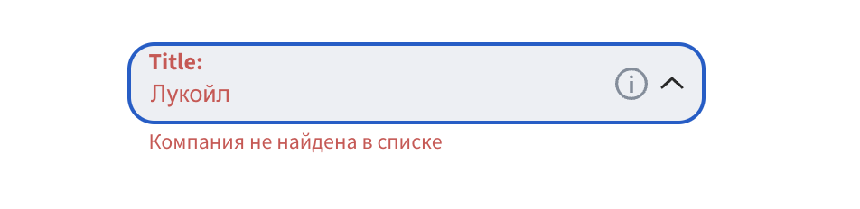
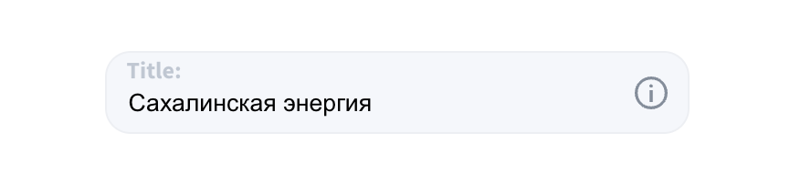
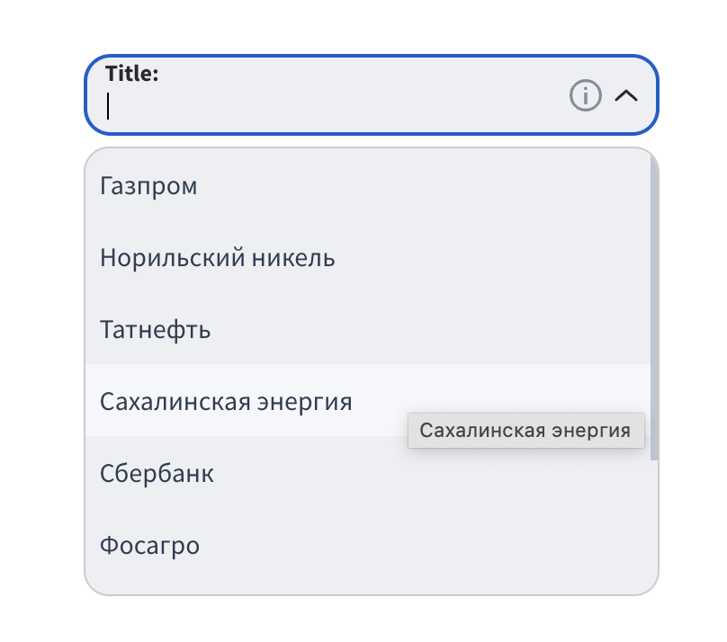

# Компонент Select

Компонент `Select` является настраиваемым выпадающим списком, который позволяет пользователям выбирать элементы из списка. 

## Свойства компонента

### `items`
- **Тип:** Array
- **Описание:** Список элементов для выбора. Каждый объект может содержать следующие свойства:
  - `name` (String ): Название элемента. (обязательное свойство)
  - `isError` (Boolean): Указывает, есть ли ошибка для данного элемента.(не обязательное свойство)
  - `errorMessage` (String): Сообщение об ошибке для данного элемента.(не обязательное свойство)
  - `readOnly` (Boolean): Указывает, доступен ли элемент только для чтения.
  (не обязательное свойство)
  

## Пример данных, которые могут быть переданы в компонент `Select`:

```javascript
const items = [
  { name: 'Газпром', isError: true, errorMessage: 'Газпром недоступен для выбора', readOnly: false },
  { name: 'Норильский никель', isError: false, errorMessage: '', readOnly: false },
  { name: 'Татнефть' },
  { name: 'Сахалинская энергия' },
  { name: 'Сбербанк', isError: false, errorMessage: '', readOnly: false },
  { name: 'Фосагро', isError: false, errorMessage: '', readOnly: false },
  { name: 'Арктикгаз', isError: false, errorMessage: '', readOnly: false },
  { name: 'Лаборатория Касперского', isError: false, errorMessage: '', readOnly: false },
  { name: 'Центральное КБ морской техники «Рубин»', isError: false, errorMessage: '', readOnly: false },
];
```

### `placeholder`
- **Тип:** String
- **Описание:** Текст, отображаемый внутри поля выбора, когда ни один элемент не выбран.

### `title`
- **Тип:** String
- **Описание:** Заголовок, отображаемый над полем выбора.

### `hintIcon`
- **Тип:** String
- **Описание:** Иконка подсказки, отображаемая рядом с полем выбора.

### `hintText`
- **Тип:** String
- **Описание:** Текст подсказки, отображаемый при наведении на иконку подсказки.

### `validateFn`
- **Тип:** Function
- **Описание:** Функция валидации, принимающая два аргумента (значение и элементы списка) и возвращающая объект с полями `isError` и `errorMessage`.

### `generalErrorMessage`
- **Тип:** String
- **Описание:** Общее сообщение об ошибке, отображаемое при возникновении ошибки.

### `generalIsError`
- **Тип:** Boolean
- **Описание:** Указывает, есть ли общая ошибка.

## Пример настройки компонента `Select`:

```javascript
  <Select
  :items="items"
  placeholder="Placeholder"
  title="Title:"
  hintIcon="ℹ️"
  hintText="Text example"
  :validateFn="validateFunction"
  :generalErrorMessage="errorMessage"
  :generalIsError="isError"
/>
```

## Состояния компонента

### Основные состояния

1. **Обычное состояние**:
   - Компонент отображается с плейсхолдером и позволяет пользователю вводить текст для поиска элементов.
   

2. **Состояние ошибки**:
   - Компонент отображает сообщение об ошибке, если введенное значение не проходит валидацию или выбран элемент с ошибкой.
   
   
   

3. **Состояние только для чтения**:
   - Компонент отображает выбранный элемент и не позволяет изменять его.
   

### Подсказки и ошибки

- **Подсказка**: Отображается при наведении на иконку подсказки, если указаны свойства `hintIcon` и `hintText`.
- **Общая ошибка**: Отображается ниже поля выбора, если указаны свойства `generalErrorMessage` и `generalIsError`.
- **Ошибка элемента**: Отображается ниже поля выбора, если выбран элемент со свойством `isError`.

## Примеры использования

### Обычный режим
Компонент `Select` используется для выбора элемента из списка, позволяя пользователю вводить текст для поиска.

### Режим с ошибками
Компонент `Select` отображает ошибки, если введенное значение не проходит валидацию или выбран элемент с ошибкой.

### Режим только для чтения
Компонент `Select` используется для отображения выбранного элемента без возможности его изменения.

## Примечания

- Компонент поддерживает валидацию вводимого значения с помощью пользовательской функции `validateFn`.
- Элементы списка могут быть отмечены как доступные только для чтения, что предотвращает их выбор и изменение.
- При возникновении ошибок, компонент отображает соответствующие сообщения об ошибках для пользователя.


### Свойства компонента Select

Компонент `Select` является настраиваемым выпадающим списком, который позволяет пользователям выбирать элементы из списка. Ниже приведена таблица свойств компонента.

| Свойство              | Тип     | По умолчанию                               | Описание                                                           |
|-----------------------|---------|--------------------------------------------|--------------------------------------------------------------------|
| `items`               | Array   | `[]`                                       | Список элементов для выбора.                                       |
| `placeholder`         | String  | `'Placeholder'`                         | Текст, отображаемый, когда элемент не выбран.                      |
| `isReadOnly`          | Boolean | `false`                                    | Делает компонент доступным только для чтения, если установлено в `true`. |
| `hintText`            | String  | `'Text example'`                                       | Подсказка, отображаемая рядом с выпадающим списком.                |
| `generalErrorMessage` | String  | `' '`   | Сообщение об общей ошибке.                                         |
| `companyErrorMessage` | String  | `'Компания не найдена в списке'`                     | Сообщение об ошибке, если компания не найдена.                     |

### Описание свойств

1. **items**: Массив объектов, представляющих элементы списка для выбора. Каждый объект должен иметь как минимум свойство `name`.
2. **placeholder**: Строка, отображаемая внутри поля выбора, когда ни один элемент не выбран.
3. **isReadOnly**: Булевое значение, которое определяет, можно ли изменять выбор. Если `true`, то выбор невозможен.
4. **hintText**: Строка подсказки, которая может помочь пользователям с выбором.
5. **generalErrorMessage**: Строка, отображаемая при возникновении общей ошибки.
6. **companyErrorMessage**: Строка, отображаемая, если выбранная компания не найдена.


# Компонент Dropdown

Компонент `Dropdown` представляет собой выпадающий список, который отображает элементы и позволяет пользователю выбирать один из них.



## Свойства компонента

| Свойство | Тип   | Описание |
|----------|-------|----------|
| `items`  | Array | Список элементов для отображения в выпадающем списке. Каждый элемент должен содержать следующие свойства: <ul><li>`name` (String): Название элемента.</li><li>`isError` (Boolean, необязательно): Указывает, есть ли ошибка для данного элемента.</li><li>`errorMessage` (String, необязательно): Сообщение об ошибке для данного элемента.</li><li>`readOnly` (Boolean, необязательно): Указывает, доступен ли элемент только для чтения.</li></ul> |

## События компонента

| Событие | Тип     | Описание |
|---------|---------|----------|
| `select` | Function | Событие, которое срабатывает при выборе элемента. Элемент, который был выбран, передается в качестве аргумента. |

# Демо работы компонента Select
## https://select-vue-3.vercel.app/


# select_vue3

This template should help get you started developing with Vue 3 in Vite.

## Recommended IDE Setup

[VSCode](https://code.visualstudio.com/) + [Volar](https://marketplace.visualstudio.com/items?itemName=Vue.volar) (and disable Vetur).

## Customize configuration

See [Vite Configuration Reference](https://vitejs.dev/config/).

## Project Setup

```sh
npm install
```

### Compile and Hot-Reload for Development

```sh
npm run dev
```

### Compile and Minify for Production

```sh
npm run build
```
# select_vue_3


Эта документация охватывает основные аспекты работы с компонентом `Select` и его возможные состояния, чтобы упростить его использование и интеграцию в проект.